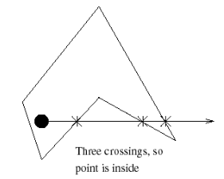
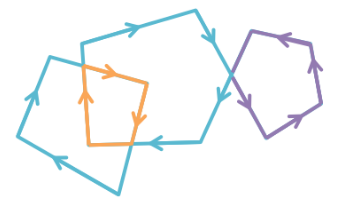

## Trabalho 1

### Membros

- Gabriel Christo - 117217732

- Lucas Guimarães - 114136076

### Objetivo

Rasterização de primitivas gráficas.

### Implementação Extra

Como implementação extra, escolhemos a segunda alternativa, que consiste de rasterizar polígonos não-convexos utilizando o teste de interseção winding number.

Com isso acabamos implementando três maneiras para verificar se dado ponto está dentro de um polígono:

- Side checking: nesse teste, válido apenas para polígonos convexos, verificamos se dado ponto está do mesmo lado de todos os segmentos do polígono. Caso positivo o ponto está no interior do polígono. Vale lembrar que o lado correto depende da orientação dos pontos (horária ou anti-horária).

- Crossing number: Também conhecido como ray casting, esse algoritmo conta o número de vezes que um raio horizontal a partir um ponto, cruza com algum segmento do polígono. Se o valor final for ímpar, então o ponto está no interior do polígono.

- Winding Number: Esse algoritmo calcula quantas voltas fechadas o polígono realiza em volta do ponto, como ilustra a imagem abaixo. Se o número de voltas for maior que zero, o ponto está no interior do polígono.

